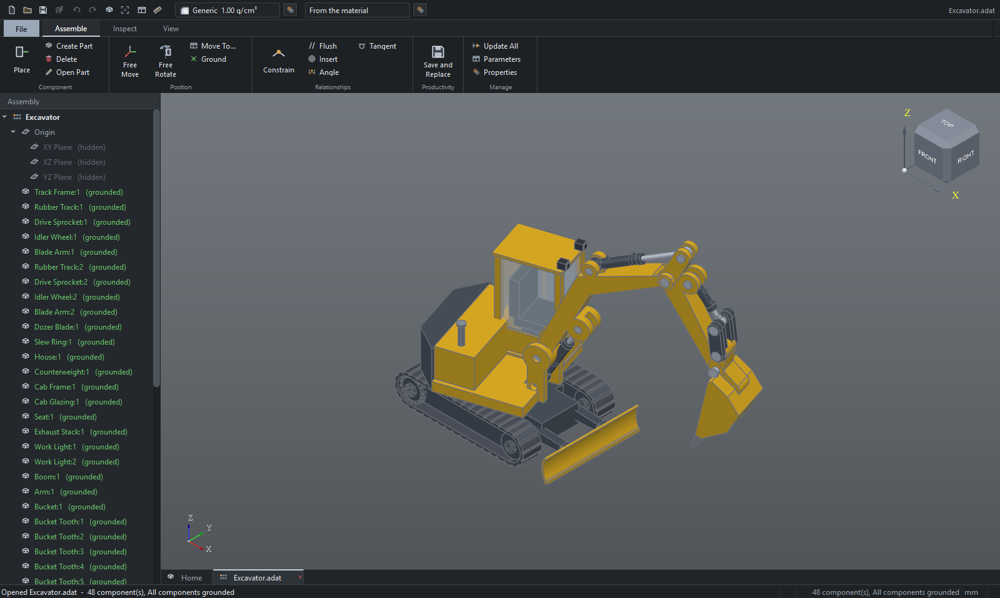

# DATUM

A parametric, history-based solid modeller with an Inventor-style interface,
built on the OpenCASCADE kernel. Sketch with a constraint solver, model
solids on a feature tree you can go back into, assemble, draw, and cut.

[**Download for Windows**](https://datum.iiteg.com) &nbsp;·&nbsp;
[datum.iiteg.com](https://datum.iiteg.com) &nbsp;·&nbsp;
[Changelog](https://datum.iiteg.com/changelog.html) &nbsp;·&nbsp;
MIT licensed



## Running it from source

```bash
datum.bat
```

or directly:

```bash
.venv\Scripts\python.exe datum.py
```

## What it does

**Sketching**
- Line chains, circle, arc, spline, point
- **Rectangle**, with its variants behind one drop-down the way Inventor
  groups them: Two Point, Three Point, Two Point Center, Three Point Center,
  then Slot as Center to Center, Overall, Center Point, Three Point Arc and
  Center Point Arc, then Polygon. The button keeps whichever you used last,
  so the common two-point rectangle stays a single click
- A straight slot comes out the way Inventor builds one: sides tangent to
  the ends, ends of equal size, a construction centre line between the arc
  centres and a **centre point** held at its middle, so Coincident between
  that point and anything else centres the slot on it
- A rectangle drawn at an angle is held square by parallels on the opposite
  sides and one perpendicular, since horizontal and vertical no longer apply
- 2D fillet, trim (splits at real intersections), offset
- **Project Geometry**: click a model edge, or a face to bring its whole
  outline over at once. A projection is a shadow of the model and is cast
  again whenever the model changes
- A numeric constraint solver (Levenberg-Marquardt) over coincident,
  horizontal, vertical, parallel, perpendicular, equal, tangent, concentric,
  midpoint, point-on, symmetric and grounded constraints
- **Heads-up input**: draw a rectangle or circle and type the size straight
  into the fields at the cursor — Tab between them, Enter to commit. The typed
  values become driving dimensions
- **Dimensions**: pick the geometry, move to place the label, click, then type
  the value into a popup at the cursor. Double-click one to edit it
- What you pick decides what is measured: two points or one line give a
  length, **two parallel lines measure across the gap**, a line and a point
  measure square onto the line, two crossing lines give the angle, a circle
  gives a diameter
- **Where you place the label decides which length you get**, the way Inventor
  does it rather than as a mode set beforehand: drag out above or below and
  it becomes the horizontal distance, out to one side and it becomes the
  vertical, anywhere else and it stays the direct one between the two points.
  An axis with nothing to measure on it is never offered
- A perpendicular dimension carries which side it was taken from in the order
  of its points, so the value you type is the value you see and the geometry
  does not jump through the line to the far side
- **Right-click while a tool is running and OK is the first thing offered** -
  one click to stop drawing and go back to selecting, instead of Escape,
  Escape. With nothing running there is no OK, because there is nothing to
  finish
- Values accept expressions — `plate_w / 2` stays linked
- **Constrained geometry is white, geometry that can still move is
  purple-blue**, worked out from the null space of the constraint Jacobian
- **Nothing rides along with the cursor.** What the next click would take
  lights up instead: a line goes **green** under the cursor and **blue** once
  picked, and so does a point. A marker only appears where a snap has landed
  on something there is otherwise nothing to see - a midpoint, a point on a
  curve
- **Points are not drawn until they matter.** A bare sketch is lines, the way
  Inventor shows one. A point comes up **green** under the cursor, **blue**
  when picked, **yellow** while being dragged, and **green again the moment it
  magnetises onto another point** - it stops following the mouse, sits exactly
  on its target and gets a ring round it, so what you see before letting go is
  what you get. Release and the two are made coincident. The origin and any
  grounded point stay visible, because they are what everything else is
  anchored to
- Every sketch is grounded at its plane origin, whether it sits on a datum
  plane or a model face
- **Select geometry and it tells you what is holding it.** A glyph appears
  for every constraint on the selection - the vertical on a line, the
  coincidents at its ends, the parallel to its neighbour - laid out in a row
  beside it. Selecting a point shows every coincident on that point, however
  many there are
- **A glyph can be deleted on its own.** Click it (green under the cursor,
  blue once picked) and press Delete: the constraint goes and the geometry
  stays. An accidental constraint should not cost you the line it landed on
- Degrees-of-freedom readout, conflict detection, auto horizontal/vertical
  constraints while drawing
- Snapping to endpoints, midpoints, centres, on-curve points, the origin and
  the grid — hold **Alt** to suspend snapping, **Ctrl** to ignore the grid.
  The grid itself is not drawn unless you turn **Show Grid** on
- Drag geometry and the solver keeps every constraint satisfied
- **Box selection**, the way every CAD package does it: drag left to right for
  a window that takes only what is completely inside, right to left for a
  crossing box that takes anything it touches - including a line running
  straight through with both ends outside. A window over two nearby endpoints
  picks up the points but not their lines, which is how you select two ends
  and make them coincident

**Features**
- Extrude (distance / symmetric / through-all / **to a plane**, taper), with
  Join, Cut, Intersect or New Body. To Plane runs up to any datum or work
  plane, and a tilted one cuts the end on its slope
- Revolve about a sketch axis, an origin axis or a work axis
- Sweep a profile along a path sketch; Loft between any number of sections
- Hole — simple, counterbored, countersunk; drilling direction picked from the
  geometry
- Fillet, Chamfer, Shell
- Rectangular and circular patterns of *features*, along or round an origin
  axis or any work axis; Mirror (body or features) about a datum or work
  plane
- Box, cylinder, sphere, cone, torus primitives
- Work planes pulled off any flat face or datum plane — press, drag away, and
  release to set the offset, then type an exact value if you want one. The
  plane tracks its face as the model changes
- **Work axes**: where two planes meet, along an origin axis, or along a
  straight edge or through the centre of a round face selected before
  pressing **Axis**. Shown as a dashed line through the model; Reverse
  direction picks which way a pattern along it runs
- Move Body
- STEP / IGES / BREP import as a base body

**Model**
- **Parameters the way Inventor keeps them.** Model parameters are made by
  modelling: every sketch dimension, and every value a feature is given,
  an extrude's distance, a fillet's radius, a plane's offset, a pattern's
  spacing, each with a name of its own, d1, d2 and so on across the whole
  part. User parameters are the ones added by name. Both sit in one table
  (`Ctrl+P`), any of them can be written in terms of any other, and an edit
  in the table changes the dimension or the feature itself. Units (`mm`,
  `in`, `deg`, …), dependency ordering and circular-reference detection
  across the lot. Rules reach them all: `params.d7 = 30`
- Full feature tree: reorder, suppress, roll back, edit anything at any time.
  A sketch consumed by a feature nests underneath it and goes out of sight,
  as in Inventor, until **Show Sketch** brings it back; **Share Sketch** keeps
  a second row at the top level so other features can use it too, and keeps
  it shown
- Drag the **End of Part** marker to roll the model back to any point
- Undo / redo across the whole document
- Live mass properties: volume, area, mass by material, centre of mass,
  bounding box
- **dProperties**, DATUM's iProperties: title, part number, designer,
  revision, project, stock number, vendor, cost and the rest, plus any
  number of **custom** properties with a name of your own. They are saved in
  the file, a parts list can show any of them as a column, and a title block
  asks for one as `{Model.Vendor}`
- Export STEP, STL, IGES, BREP

## File format

DATUM documents are ZIP archives, following Inventor's naming convention:

| Extension | Type |
| --- | --- |
| `.pdat` | Part |
| `.adat` | Assembly |
| `.cdat` | CAM sheet |
| `.ddat` | Drawing |

Each archive holds:

```
manifest.json    format, schema version, type, units, created, modified
geometry.json    the model
thumbnail.png    256x256 preview, rendered from the viewport on save
```

Because it is a plain ZIP with a real PNG inside, the OS and any file browser
can show the preview without understanding the model.

Reading always starts with the manifest. A file that does not declare itself
as DATUM is rejected by name; one written by a **newer** schema is refused
outright rather than half-parsed. Older schemas — including the previous
`.forge` files — migrate forward on open, and the status bar says so.

Saves write to a temporary file and swap it into place, so a failure never
destroys the copy already on disk. JSON is deflated at level 1 and the PNG is
stored uncompressed, which keeps saves fast.

Assemblies and CAM sheets reference their parts by **relative path**, so a
project folder moves as a unit, and also store each referenced file's
**name** — if a component goes missing, DATUM can say which file, where it
expected it, and why it could not be used. Save As into another folder
rebases the links rather than breaking them.

> Parts, assemblies and CAM sheets are editable. The drawing document is
> complete as a document — it round-trips, validates, migrates, carries a
> thumbnail and reports broken links — but there is no editor for it yet,
> and DATUM will tell you so if you try to open one.

## Bodies and Booleans

The first solid in an empty part is not asked how to combine — there is
nothing to combine with. It gets a **Body Name** instead, which is the only
decision left.

Every solid after that gets the **Boolean** row, in Inventor's order:

| | | |
| --- | --- | --- |
| **Join** | add this material to the body | the default |
| **Cut** | take it away | |
| **Intersect** | keep only the overlap | |
| **New Body** | leave it as a separate solid | multibody |

A part holding more than one solid grows a **Solid Bodies** folder in the
browser, named and counted. One body gets no folder, because a folder that
says "1" is not telling you anything.

A feature aimed at a particular solid finds it: a cut lands in the body the
tool actually meets, and a fillet rounds the body that owns the edges, not
whichever solid happens to be first. Without that a cut meant for the second
body comes out of the first and looks like it did nothing.

**Seams are merged.** Extrude two touching profiles in one go, or join a boss
flush onto a plate, and the result is one solid with one face across the top —
not two coplanar faces with a line between them. The line would be real
topology, not a drawing artefact: it splits the face you want to sketch on,
and it exports to DXF. The merge is skipped if it would change the volume,
because a unify that alters the shape has done something other than tidy it.

Profiles that do not touch stay separate inside the body, which is what lets
one extrude cover several islands of a sketch. Choose **New Body** and they
keep their own faces, because then they really are separate solids.

## Open documents

Every file lives in one window, behind a tab strip along the bottom, with
Home at the front. That is Inventor's arrangement, and it is deliberately
not SolidWorks': a second document does not get a second copy of the
application.

- **Home** is the start page and never closes; every other tab is a document
- Ctrl+Tab cycles, Ctrl+W closes, middle-click closes, right-click a tab for
  Save and Close All Others
- Each document keeps its own camera, so switching back returns you to the
  view you left
- A tab carries `*` while the document is unsaved

**Editing a part from an assembly** opens the part in its own tab — or
switches to that tab if it is already open, rather than loading a second,
diverging copy. The part and the assembly are then the same object in memory.

**Local Update** (the lightning bolt in the quick access toolbar, Ctrl+U) is
what carries an edit across. A part changed in its own tab does not push
itself into every assembly and CAM sheet that places it; those documents are
*told* they are behind — the button lights, the status bar names the part,
and the tab turns amber — and update when you say so. Nothing rebuilds behind
your back, and the part does not have to be saved first.

The staleness test compares a digest of the document rather than counting
rebuilds, so previewing a dialog, cancelling it, or simply visiting a part's
tab does not make an assembly claim to be out of date.

## Assemblies

Components are *placed*, never copied: each occurrence keeps a path, and the
body is reloaded from that file whenever it changes on disk.

- **Place Component** brings in parts and sub-assemblies; the first one is
  grounded automatically, and the rest are set down beside it
- Constraints are **Mate**, **Flush**, **Angle**, **Tangent**, **Insert** and
  **Parallel**, picked off faces and edges without saying which first.
  Parallel holds two faces or axes the same way round and leaves every slide
  free; Aligned or Opposed decides which way the faces look
- They are solved as rigid placements — six unknowns per free component,
  driven by the same damped least-squares core as the sketch solver — so the
  browser can report the degrees of freedom that are left
- **Free Move** and **Free Rotate** drag components in the plane of the
  screen; the constraints re-solve on release
- Ground, hide, isolate, suppress and replace any component

## CAM

Flat parts laid out on stock, offset for the cutter, exported as DXF. Built
for **MyPlasm CNC**, which takes 2D paths and does its own depth stepping, so
DATUM exports geometry rather than G-code and applies the cutter
compensation itself.

- A part is recognised as sheet stock by its **two opposed planar faces** —
  the largest such pair is the sheet, and their separation is the material
  thickness. A part with anything standing proud of that is refused, with the
  measurement that proves it
- The cut face is stored as a **persistent named reference**, the same
  mechanism a fillet uses. It is re-detected only when it fails to rebind,
  and says so rather than silently switching faces
- **Flip** reads the part off the other side of the sheet, which mirrors it —
  the thing that is invisible until something comes off the machine backwards
- **Auto Arrange** grids parts by bounding box with a gap of 1.5 tool
  diameters, plus the clamp margin and the tool radius at the sheet edge.
  Parts moved by hand keep their positions through a regenerate
- Outer profiles offset outward, holes and slots inward, per profile, using
  OCCT's 2D offset so arcs stay arcs. Tangential lead in and lead out
- Holes are cut before the outline that frees the part
- It refuses to export a nest it cannot cut: a profile narrower than the
  tool, a part off the sheet or over the clamp margin, parts that overlap
  once offset, or stock whose thickness does not match the part
- The toolpath is drawn over the parts in the viewport before it is exported;
  the operator imports the DXF with MyPlasm's own offset switched **off**

**Planes**
- The three origin planes are visible on a new part and stand down by
  themselves once the first feature gives the part a body — once, so if you
  turn them back on they stay on
- Work planes appear as soon as you make them and stay until you hide them
- Planes behave like faces: hover to highlight, right-click for **New Sketch**,
  **Visible**, **Edit Plane** and **Delete Plane**. They never leak into a
  feature dialog's face or edge selection
- Right-click any plane in the browser for the same checkable **Visible**
  entry; the state is saved with the part
- Double-click a plane — origin or work plane — to start a sketch on it
- Sketch mode clears every plane, so the sheet you are drawing on is the only
  thing in the way

**Viewport**
- Hovering the model highlights the individual **face** under the cursor, not
  the whole body, so you can see what you are about to sketch on. Right-click
  a flat face for **New Sketch on this Face** or **Work Plane from this Face**
- ViewCube, triedron, origin geometry, adaptive sketch grid
- Orbit / pan / zoom-at-cursor, standard views, orthographic and perspective
- Shaded, shaded-with-edges, wireframe and X-ray display
- Section view
- Selection filters for body, face, edge and vertex, with pre-highlighting

## Navigation

| Action | Input |
| --- | --- |
| Orbit | Right-drag, or Shift + middle-drag |
| Pan | Middle-drag |
| Zoom | Wheel (zooms at the cursor) |
| Fit all | `Home` |
| Home view | `F6` |
| Select | Left-click, `Ctrl` to add |
| Cancel | `Esc`, wherever the keyboard focus is |

**Preferences → Display → Orbit** picks between the free orbit and a
**turntable**: it spins about Z and tilts, Z always stays up the screen, and
the tilt stops at looking straight down or straight up instead of going
over the top. A SpaceMouse follows the same choice and drops its roll.

A 3Dconnexion SpaceMouse is picked up automatically, either straight off its
HID interface or through 3DxWare when that has the device — see
[SpaceMouse](#spacemouse) below. Slide to pan, push or pull to zoom, tilt and
twist to orbit. **View → SpaceMouse** opens speed, dead-zone and per-axis
reverse settings, with a live readout of the six axes.

## Shortcuts

`Ctrl+N` new · `Ctrl+O` open · `Ctrl+S` save · `Ctrl+Z` / `Ctrl+Y` undo/redo ·
`Ctrl+P` parameters · `S` sketch · `E` extrude · `R` revolve · `H` hole ·
`F` fillet · `L` line · `C` circle · `A` arc · `Ctrl+R` rectangle ·
`D` dimension · `Esc` cancel the current tool

## How it is put together

```
datum/
  core/
    params.py     named parameters, safe expression evaluation
    sketch.py     2D geometry, constraints, the solver
    kernel.py     every OpenCASCADE call, with real error messages
    naming.py     persistent face/edge references across rebuilds
    features.py   the feature types and the rebuild context
    document.py   parameter table + feature tree + undo
    fileformat.py the .pdat/.adat/.cdat/.ddat ZIP container
    lstsq.py      damped least squares, shared by both solvers
    constraints3d.py  assembly constraints and the rigid-body solver
    assembly.py   assembly and drawing documents
    parts.py      referenced bodies, cached by modification time
    sheet.py      cut face detection and flattening
    toolpath.py   cutter compensation, leads, ordering, validation
    cam.py        the CAM sheet document
    hlr.py        hidden line removal: a shape becomes classified lines
    drawing.py    sheets, views, annotations, title blocks, hatch patterns
    views.py      generating every view, and keeping annotations bound
    bom.py        what an assembly is made of, counted up
    templates.py  drawing templates, shipped and per-project
    project.py    the project file and its recent-file list
    dxf.py        R12 writer, for faces, sketches and toolpaths
    fileio.py     STEP / IGES / STL / BREP
  ui/
    viewport.py   OCCT view hosted in a native Qt widget
    session.py    every open document, and what each knows of the others
    doctabs.py    the open-document tab strip along the bottom
    sketcher.py   interactive sketching on the plane
    ribbon.py     tab strip and command panels
    browser.py    the model tree
    assembly_browser.py / assembly_ui.py   the assembly workspace
    cam_browser.py / cam_ui.py             the CAM workspace
    drawing_browser.py / drawing_ui.py     the drawing workspace
    sheet_canvas.py  the sheet, panned and picked on
    sheetpaint.py    one routine that paints a sheet, for any painter
    drawingexport.py PDF, SVG, DXF, print and picture
    resolvelink.py   repointing references whose files have moved
    dialogs.py    feature dialogs with live preview
    panels.py     parameters, properties, measure
    main_window.py
    icons.py      every icon drawn at runtime — no image assets
    theme.py      palette and stylesheet
```

### Two things worth knowing

**Topological naming.** Referring to "edge 7" breaks the moment you insert a
feature earlier in the tree. `naming.py` stores a geometric fingerprint —
position, size, surface or curve type — and re-binds to the best match after
every rebuild, falling back to the stored index only as a last resort. That is
why changing `plate_w` from 60 to 100 keeps the fillets on the right corners.

**Failures are contained.** A feature that throws is marked with its error and
skipped; the rest of the tree still builds on the body that existed before it.
A broken fillet costs you the fillet, not the model.

## Drawings

A drawing (`.ddat`) holds no geometry. It references parts and assemblies by
path and generates its views from them, so changing a model changes every
drawing of it. What it does hold is the result of that generation, cached,
plus a hash of each model - which is how it opens and prints without loading
a single model, and how it knows to say **Update** rather than quietly
printing yesterday's part.

**Views.** A base view puts a model on the sheet. Projected views come off
it, and which one you get depends on where you drag: ISO first angle puts
the top view *below* and the left view to the *right*; ANSI third angle puts
them the other way round. One sign, and the whole sheet changes meaning, so
it is a property of the drawing and not of each view. Sections cut the model
on a line drawn across the parent; details enlarge a circle of it. Hidden
lines, tangent edges and silhouettes come back classified separately and are
drawn with their own pen weights.

**Hatching.** A section finds the faces the cutting plane actually made -
asked of the cut solid, not assumed, because a cut through a hollow part
makes several and misses others - and fills them. The pattern comes from the
model's material unless a view names one, so a plywood panel and its steel
bracket do not read as the same thing on one sheet. Where the lines fall is
worked out once, in `drawing.hatch_lines`, so the screen, the PDF and the
DXF are filling a face with the same lines and not with three
approximations of the same idea.

**Parts lists and balloons.** A parts list reads the assembly every time the
drawing is rebuilt rather than storing what it was told once, so a component
added upstairs turns up without being asked for; the rows are still written
into the file so a drawing opened away from its models can draw the list it
had. Occurrences are grouped by the file they came from, which is what makes
two of a part one line of two rather than two lines. A balloon holds the
file it points at, not the number - the number is read back from the list
every time it is drawn, so renumbering the list renumbers the balloons and
the two cannot drift apart. Auto Balloon spreads them round the view and
points each one at the corner of its part facing the bubble, rather than at
a centroid buried inside the assembly.

**Title blocks** carry three kinds of field: typed text, a property link
resolved every time it is drawn, or a question asked once when the block is
placed. The links cover `{Model.*}` - resolved from the sheet's first base
view, so a part and an assembly answer the same questions - and
`{Drawing.*}`, `{Sheet.*}`.

**Templates** are not a special file. A template is an ordinary `.ddat` in a
folder called Templates, and New Drawing copies one. Anything you can draw
you can keep as a template, and you can open one and check it. The project's
own templates come before the shipped ones, so a company title block quietly
replaces the default.

**Output.** The sheet is painted with QPainter rather than rendered through
the 3D viewport, and that one routine serves the screen, PDF, SVG and the
printer. So the PDF is real vector output at true size rather than a picture
of the window, and what prints is what you saw. DXF is the exception - it is
written directly, on layers per line kind, and is the one export that
converts rather than copies: geometry and text survive, pen weights and
paper do not.

## Projects

Inventor's idea, and a good one. A project is a file sitting in a folder,
and that folder is where documents are saved and looked for. Switching
project switches the place everything happens - and the recent list with
it, so two jobs never leave their files interleaved in one directory.

A fresh install has a project already: **Default**, in `Documents/DATUM`.
Nothing has to be set up before the first part can be saved.

**File -> Projects...**, or the project name on the home page, opens the
list. *New Project...* asks for a folder and a name and writes a `.dproj`
there; *Add Existing...* picks up a `.dproj` that came with a folder from
somewhere else. The active project cannot be removed from the list, because
that would leave nowhere to save.

What is *in* a project - its name, its recent documents - lives in the
`.dproj` file. What is merely true of this machine - which projects are
known about, which is active - is settings. That split is what lets a
project folder be copied to another machine, or onto a memory stick, and
still make sense when it gets there.

## Dimensions

Every dimension gets a name of its own, d1, d2, d3, in the order they are
placed, and the numbering runs across the whole part, so a second sketch's
first dimension is not a second d1. One can then be written in terms of
another: type an expression like `(10 - 2 + d2) / 2` into any dimension box,
or click an existing dimension in the viewport while the box is open and its
name is written in for you. Every other parameter of the part works in the
same box, another sketch's dimensions and feature values included. A part
saved when each sketch counted from d1 is renamed as it opens, and each
sketch's expressions follow its own dimensions. A dimension cannot be written in
terms of itself, and one that refers to something no longer there keeps its
last good value rather than collapsing the sketch to zero.

What a pair of picks measures depends on what was picked:

| picked | dimension |
|--------|-----------|
| two points, or one line | distance, or horizontal / vertical by where the label goes |
| two parallel lines | perpendicular distance across the gap |
| two lines at an angle | the angle between them |
| a line and a point | the point's distance square onto the line |
| a circle or arc | diameter |

Horizontal, vertical and perpendicular distances are all measured from a
signed residual, so the pick order is arranged to match the number being
shown. Pick two points right to left, type 50, and the geometry stays where
it is - it does not swing through to the far side and need a typed -50 to
come back. Angles are held as the directed angle for the same reason.

## Tests

`tests/run.py` runs them several at a time:

```bash
.venv\Scripts\python.exe tests\run.py
```
```bash
.venv\Scripts\python.exe tests\run.py --fast
```
```bash
.venv\Scripts\python.exe tests\run.py cam sketch
```

Almost all the wall time is Qt and OpenCASCADE starting up: the six core
suites cover the geometry in about three seconds between them, while the
other twenty-three each build a whole MainWindow first. That cost is per
process and can only be overlapped, never shared, which takes the full sweep
from 3m40s down to about a minute. `--fast` skips every suite that needs a
window; a word argument runs the suites whose names match it, which is
usually all a change deserves.

Any suite still runs on its own:

```bash
.venv\Scripts\python.exe tests\test_model.py
```

`tests/shot_app.py <dir>` drives a whole modelling session and writes
screenshots, which is the quickest way to see the state of the UI.

**No test ever stops to ask.** `tests/harness.py` replaces every modal the
application can raise - message boxes, file dialogs, text prompts, anything
that would run its own event loop - with one that answers itself and records
what it was asked. Importing it is the whole setup:

```python
import harness  # noqa: F401
```

The defaults are the least destructive thing that keeps the run going:
Discard where it is offered, cancelled file dialogs so nothing is read or
written by accident. A test that cares sets the answer and reads back what
was shown:

```python
harness.opening([part_a, part_b])
harness.answer(question=QtWidgets.QMessageBox.Yes)
...
assert "cannot place itself" in harness.text("warning")
```

A test that stubs one of these itself still wins, and restoring afterwards
restores the harness rather than the blocking original.

## Limits

Multibody part modelling. No sheet metal unfolding, no threads, no FEA. The
sketch and assembly solvers are numeric, so a badly-posed system converges
to *a* solution rather than refusing outright.

Drawings do base, projected, section, detail and auxiliary views with hidden
lines, hatched cut faces, dimensions, centre marks, text, balloons and parts
lists. Not yet: break and break-out views, revision tables, surface finish
and GD&T, baseline and ordinate chains, or shaded views. Auxiliary views
work but have no button of their own yet. A dimension snapped to model
vertices is bound to them by name and follows the model through edits; one
dropped on empty paper is not, and stays where it was put.

CAM is 2D profile work only: no pocketing, no adaptive clearing, no 3D
surfacing, no machine simulation, and no true nesting optimisation — layout is
bounding-box grid plus hand adjustment. It exports DXF, not G-code, because
the target machine wants 2D paths and does its own depth passes.

## Releasing

DATUM itself is about four megabytes of Python. The runtime under it is
569 MB, which is what a 0.2.1 build measures: 264 MB of VTK, 155 MB of
OpenCASCADE, 91 MB of Qt after the exclude list has taken it down from
641, and 26 MB of numpy. The installer compresses that to 106 MB.

That decides how releases work. Shipping the whole application again for
every fix would be a 571 MB download to change a line, and nobody would
take one. So a release publishes a manifest of every file with its hash,
and an update fetches only the files whose hashes changed. A Python-only
release is a few megabytes.

```bash
python tools/release.py 0.2.1 --notes "Hatched sections and parts lists."
```

That bumps `__version__`, runs the tests, builds, starts the built copy to
check it really works, writes and signs the manifest and the feed, builds
the installer, and tags the commit. Nothing is published if any of it
fails. Then copy `release/` to `https://api.iiteg.com/datum/`, keeping the
layout.

**One thing in the build is not optional.** `cadquery-ocp` links
OpenCASCADE's VTK bridge into a single `OCP.pyd`, so the VTK DLLs must be
bundled even though DATUM never imports VTK and has no use for it. Without
them the build looks perfectly fine and dies on first import with `DLL
load failed`. `OCP/__init__.py` also calls `os.add_dll_directory` on
`vtk.libs` and `cadquery_ocp.libs` by name, so those folders have to keep
their names. PyInstaller cannot work any of this out, because the
dependency is a link and not an import, which is why `tools/datum.spec`
collects them by hand and why `release.py` starts the build before it will
publish it.

**Installing is per user**, into `%LOCALAPPDATA%\Programs\DATUM`. A
Program Files install would need an administrator prompt to update, which
an application cannot raise for itself, so silent updates would be
impossible.

Inno writes its uninstaller into that folder *after* the build is made, so
`unins000.exe` is in no manifest. Treating "not in the manifest" as
"delete" would have destroyed the uninstaller on the first update and left
DATUM listed in Add or Remove Programs with nothing behind it, so
`update.KEEP_ALWAYS` spares it.

**The swap.** Windows will let a program rename its own executable but not
touch a DLL it has loaded, and an installed DATUM has Qt, OpenCASCADE and
the Python runtime all mapped in. So the files cannot be replaced by the
application using them. Downloads go to a staging folder inside the
install and are all verified before anything is applied; on restart a
small batch script waits for DATUM to exit, moves the staged files over,
and starts it again. If it cannot finish, it leaves staging alone and
DATUM offers it again next time, which is safe because everything in there
was checked before it was written.

**Signing.** `tools/release.py --make-key` makes an Ed25519 key; the
public half goes in `datum/core/update.py` and the private half never goes
near the repository. HTTPS proves you are talking to api.iiteg.com but not
that what it is serving came from IITEG, and an update is code that then
runs as the user. Until the key is set, `signing_enabled()` reports false
rather than quietly passing unchecked downloads off as verified.

Code signing the executable is a separate thing and is not set up. Without
it SmartScreen warns on first run and on every update.

## Requirements

Python 3.14, `cadquery-ocp` (OpenCASCADE 7.9), `PySide6`, `numpy`.
`hidapi` and `comtypes` are optional and only needed for the SpaceMouse.

## SpaceMouse

Two backends run side by side, because either can be the dead one:

* **Raw HID** (`hidapi`) reads the puck directly, no vendor driver needed.
  A wireless receiver publishes one multi-axis collection per pairing slot,
  so every matching interface is opened and drained together - opening only
  the first is how a puck ends up connected and permanently silent.
* **3DxWare COM** (`comtypes`, Windows) reads it through `TDxInput.Device`.
  When 3DxWare is installed it can take the device into its own mode, and
  then the HID interfaces open perfectly and never send anything. This path
  goes through the driver instead of around it.

Only one is ever live, so they cannot fight. **Space Mouse** on the View tab
shows which one is talking and how many frames have arrived, which separates
"nothing is connected" from "connected but nothing is coming". If neither
moves the view:

```
.venv\Scripts\python.exe tests\probe_spacemouse.py
```

It tries both backends, prints every frame as it arrives, and says which one
works. Axis directions are per-axis switches in the same dialog.

