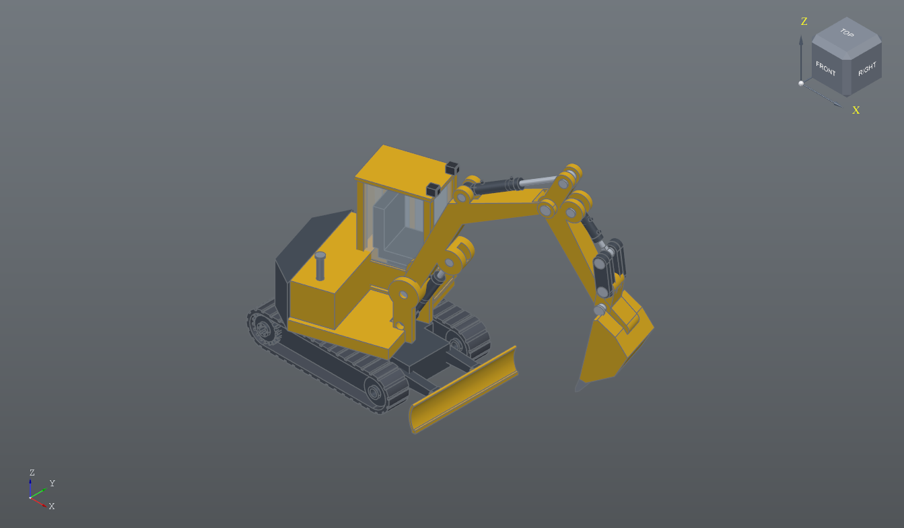
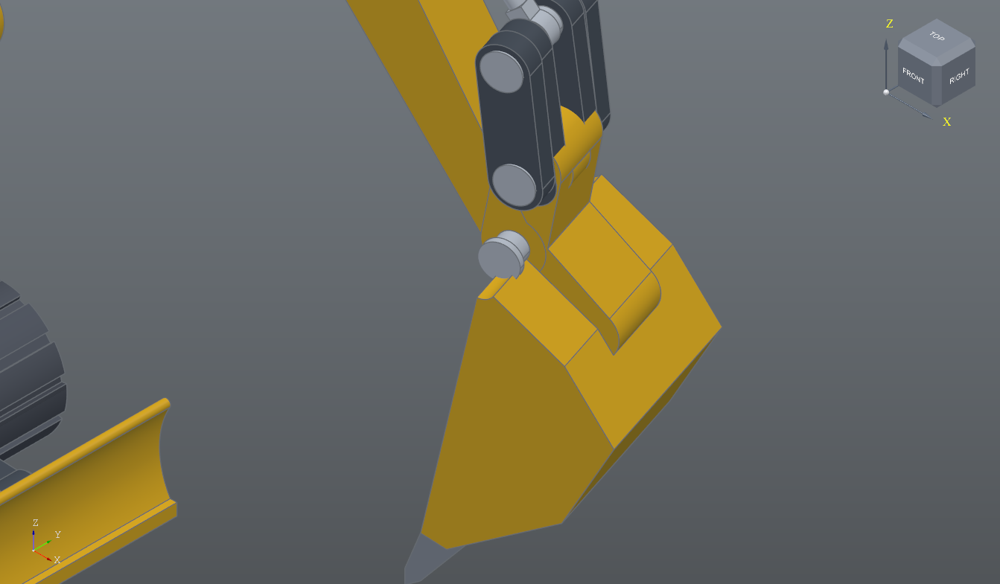
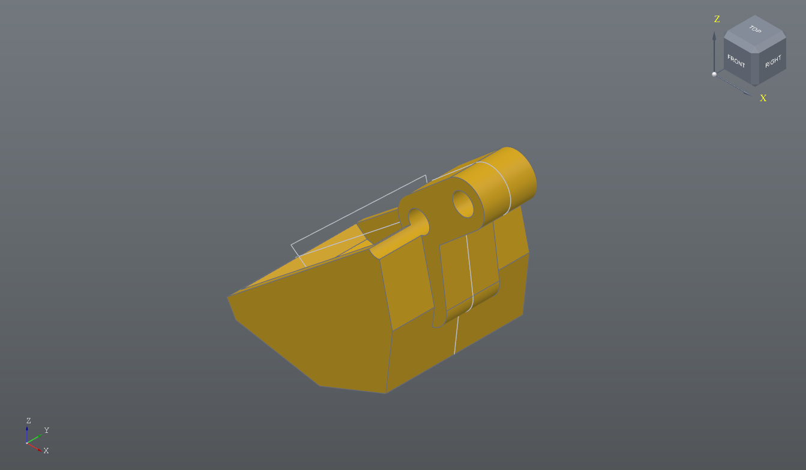
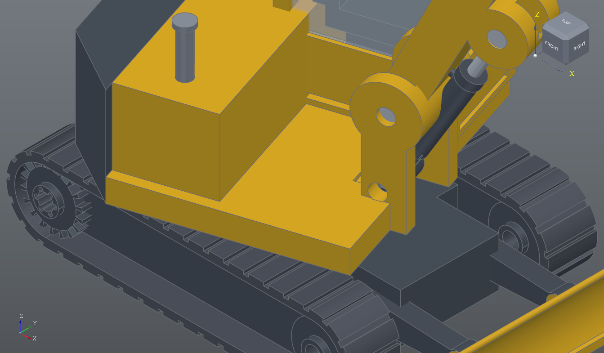
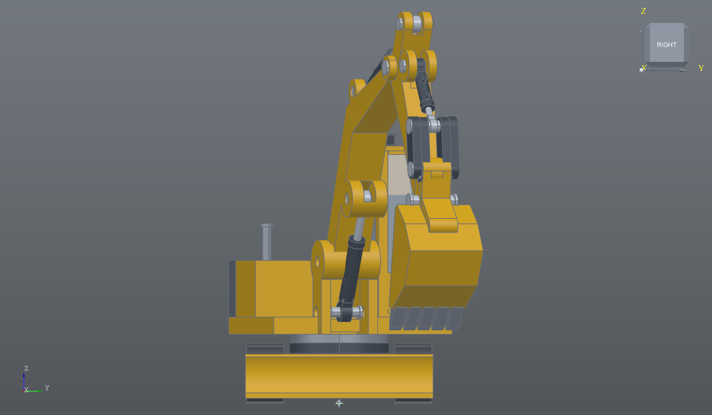

# Excavator

A tracked excavator: 26 parts, 48 components, one assembly. The tote next
door is the sample that shows the CAM side - a real sheet, a real cutter,
a real DXF - and it is a box. This is the one that shows what the modeller
carries: plate, castings, glass, rubber and polished rod, every part its
own file with its own material, and a linkage that reaches where the
geometry says it does.

    ../build_excavator.py          builds everything in this folder
    ../../tests/shot_excavator.py  opens it and takes the pictures
    ../../tests/test_excavator.py  checks it still goes together

Nothing here was drawn by hand or nudged into place. The script goes
through the same core API the buttons call, so every file opens, edits and
rebuilds normally.

## What it is

4.3 m over the bucket, 3.2 m tall, tracks 2.1 m long at 1.2 m gauge.

| part | off | material | appearance |
|------|-----|----------|------------|
| Bucket Tooth | 5 | Steel, Mild | Steel, Mill Finish |
| Pivot Pin | 5 | Steel, Mild | Steel, Polished |
| Ram Pin | 6 | Steel, Mild | Steel, Polished |
| Ram Barrel | 2 | Steel, Mild | Paint, Machine Charcoal |
| Ram Rod | 2 | Steel, Mild | Steel, Polished |
| Blade Arm, Bucket Link, Idler Link | 2 each | Steel, Mild | Paint, Machine Charcoal |
| Drive Sprocket, Idler Wheel | 2 each | Steel, Mild | Paint, Machine Charcoal |
| Rubber Track | 2 | Rubber, EPDM | Rubber, Black |
| Work Light | 2 | ABS | Plastic, Matte Black |
| Boom, Arm, Bucket | 1 each | Steel, Mild | Paint, Machine Yellow |
| House, Cab Frame, Dozer Blade | 1 each | Steel, Mild | Paint, Machine Yellow |
| Counterweight, Track Frame | 1 each | Steel, Mild | Paint, Machine Charcoal |
| Cab Glazing | 1 | Glass | Glass, Clear |
| Slew Ring, Exhaust Stack | 1 each | Steel, Mild | Steel, Mill Finish |
| Seat | 1 | ABS | Plastic, Matte Black |
| Bucket Ram Barrel, Bucket Ram Rod | 1 each | Steel, Mild | charcoal, polished |

There are two sizes of pin and not one, because the main pivots are held
in brackets 380 to 480 wide and the ram eyes in clevises half that: a pin
long enough for the boom stands out of a ram eye by the length of your
hand.  Each size still does five joints.

It masses out at 12 tonnes, which is heavier than a real machine this size
and is not a mistake: most of it is modelled as solid section where a real
one is fabricated from plate. Only the house, the hood and the track frame
are hollowed. The number is what the material densities say about the
solid that is actually there, which is the useful thing for it to say.

Two appearances were added to the library for this: **Paint, Machine
Yellow** and **Paint, Machine Charcoal**. Every part still takes its
density from a normal material - the yellow ones are all Steel, Mild - so
painting something a different colour changes nothing about what it
weighs. That separation is the whole reason materials and appearances are
two lists and not one.

## The pose is worked out, not typed in

Three angles decide the machine: the boom 38 degrees up, the arm 60 down
from the boom tip, the bucket curled 40 degrees. Everything after that is
asked for rather than measured:

    boom_at    = Placement(BOOM_PIVOT, turn_y(-BOOM_ANGLE))
    arm_pivot  = boom_at.apply_point((2260, 0, 232))
    arm_at     = Placement(arm_pivot, turn_y(-ARM_ANGLE))
    bucket_pivot = arm_at.apply_point((1250, 0, 0))

`(2260, 0, 232)` is where the boom's own drawing puts its tip bore, so the
arm hangs off the hole that is really there. Change `BOOM_ANGLE` by a
degree and the arm, the bucket, the linkage, all three rams and eleven
pins move with it, because none of them has a coordinate of its own.

The boom itself is offset 140 mm to the right of the machine's centre,
which is not decoration: the cab takes the left of the deck, and a boom
bracket on the centreline would run straight through the cab's corner
post.  Every real machine with a cab solves it the same way.

The whole upper works is built square to the world and then swung 18
degrees, by composing one rotation about Z onto the outside of every
placement in the group. That is also why the house, the cab, the boom and
its rams all agree about where the machine is pointing.

## A ram is two parts aimed at each other

A hydraulic ram is a barrel and a rod, and they are not constrained
together. The barrel is placed at one mount looking at the other, the rod
at the other mount looking back, and how far the rod is inside the barrel
is whatever the distance between the mounts leaves over - which is what a
real one does. No ram here had its stroke worked out by hand.

The build prints the check:

    Boom Ram      1062 mm between eyes, piston  282 mm into the tube  ok
    Arm Ram       1302 mm between eyes, piston  522 mm into the tube  ok
    Bucket Ram     612 mm between eyes, piston  152 mm into the tube  ok

If a pose were changed far enough that a piston left its tube, that line
would say so instead of quietly drawing a rod hanging in mid-air. It is
also why there are two sizes of ram: the bucket's is less than half the
boom's, and one cylinder will not stretch that far.

## Every joint is a clevis and a tongue

Two bosses of the same width at one pin are two parts trying to be in the
same place.  So the boom's tip is wider than its own web and then slotted,
and the arm's root sits inside it; every ram eye sits in a slot cut
through the boss it pins to.

The arm reaches back past its own pivot as a heel, and the arm ram pulls
on the end of that.  Without the heel the ram would have to reach a lug on
the near side of the pivot, which means crossing the boom to get there -
and a ram drawn through the middle of a boom is the first thing anyone
notices.  The boom ram has the same problem at the other end, which is why
the boom pivot sits high on a tall bracket: from a mount below it, the ram
reaches the boom's underside without crossing its root.

## It digs towards itself, so the bucket is drawn mirrored

An excavator is not a loader.  It drags the bucket in towards the machine,
so the mouth faces home and the teeth are pulled through the cut, and the
bucket is drawn with its lip at -X and its back plate, where both pins
are, at +X.  Drawn the other way round it can be rotated all day and never
look right: the body hangs below the pivot only when the mouth is facing
away, which is a loader bucket on an excavator arm.

Two more things fall out of that.  The bucket link and the idler link are
**cut to fit the pose** - their length is the gap between two holes on
parts that were placed by angle, so the pose is worked out first, the two
lengths come out of it, and the plates are built to suit.  And the joint
those links meet on is the floating one: the bucket ram's rod eye, two
links out to the bucket and two back to the arm all share that pin.  Leave
the idlers out and the mechanism has a degree of freedom nobody put there.

## The bucket is a solid with the inside taken out

The outline is the bucket's whole silhouette, mouth closed off, extruded
620 wide. The pocket is a second profile cut 520 wide, so 50 mm of side
plate stays at each end. The trick is that the pocket's last edge sits
*outside* the solid: that is what opens the mouth, rather than leaving a
lid on it.

## The track lugs are walked round the perimeter

The belt is a stadium - two lines and two half circles - with the inside
cut out of it. The lugs are 39 slots at 122 mm pitch, placed by walking
the outside of that loop and asking where a given distance along it lands
and which way is out. Walking it is what lets one pitch carry round the
ends and along the straights without the corners needing lugs of their
own shape.

