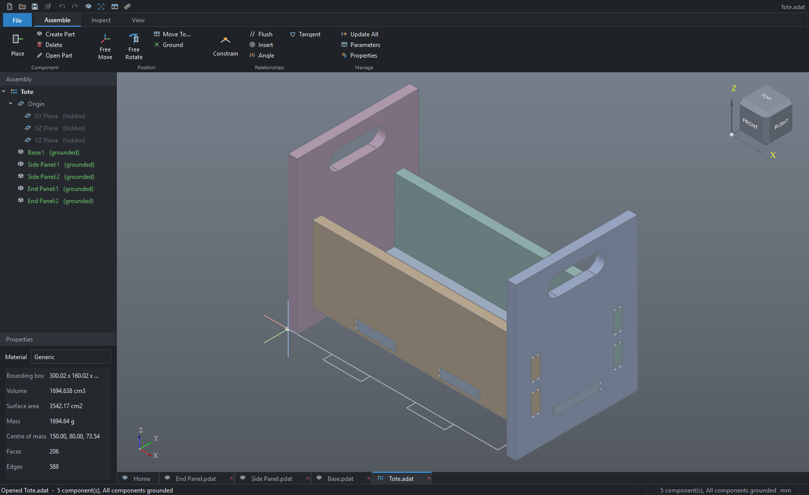
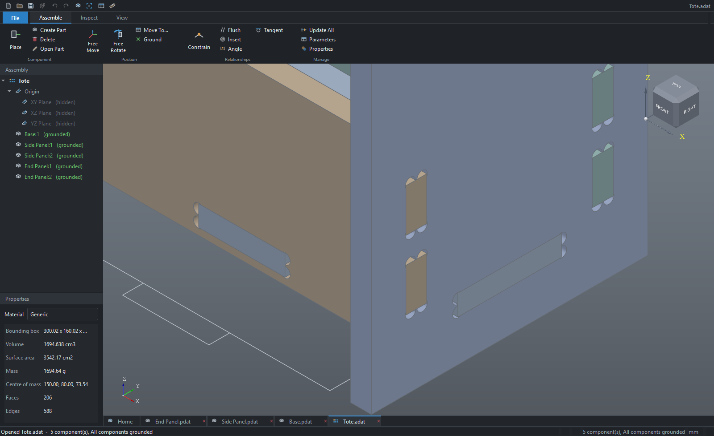
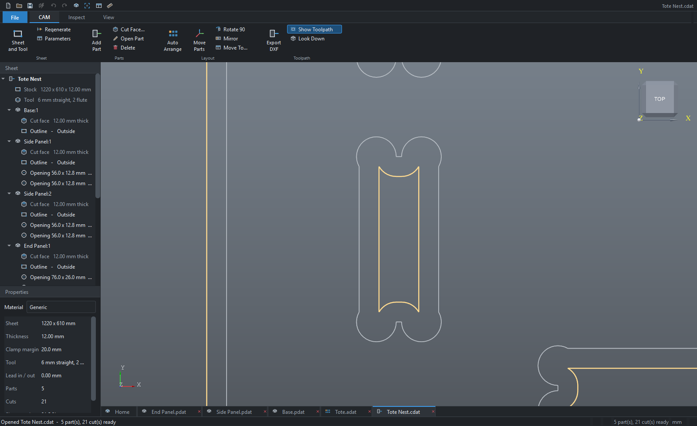
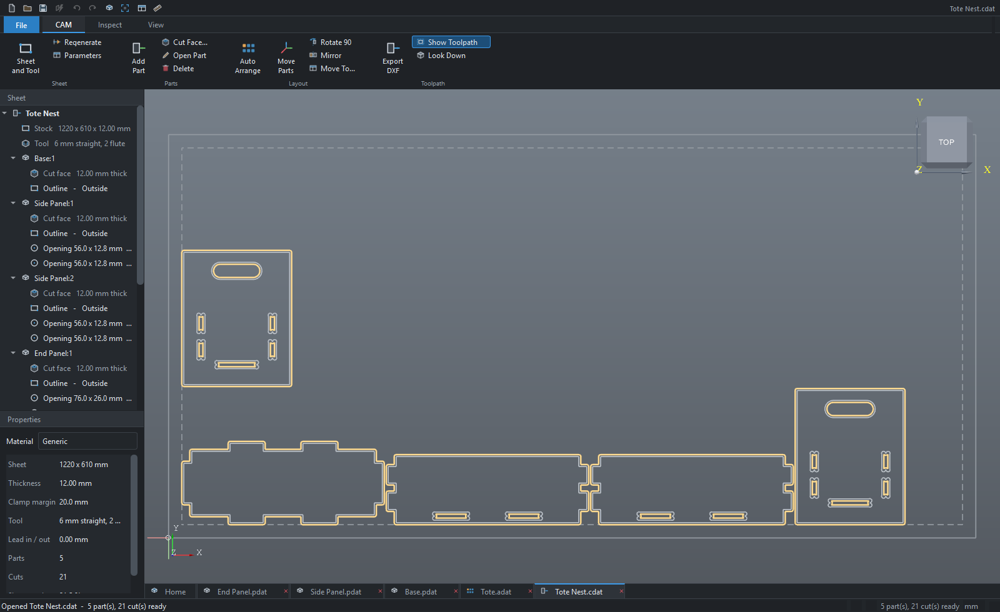

# Plywood tote

A slot-together carry tote in 12 mm plywood, built end to end in DATUM:
three parts, one assembly, one CAM sheet, one DXF.

    ../build_tote.py        builds everything in this folder
    ../../tests/shot_tote.py  opens it and takes the pictures

Nothing here was drawn by hand. The script goes through the same core API
the buttons call, so every file opens, edits and rebuilds normally.

## What it is

300 x 160 x 200 mm, five pieces from three parts, 1.69 litres of ply.

| part       | size            | does                                         |
|------------|-----------------|----------------------------------------------|
| End Panel  | 160 x 200 x 12  | x2, handle, takes every other part's tabs    |
| Side Panel | 300 x 100 x 12  | x2, tabs pass right through both ends        |
| Base       | 300 x 120 x 12  | tabs into both sides and both ends           |

There is no glue in the model and none is needed to hold it square: the
tabs and slots locate everything. Fusing all five gives a single solid,
and no pair of parts overlaps by so much as a cubic millimetre, so the
joints engage without interfering.

## The slots are relieved, because a cutter has a radius

A 6 mm cutter cannot cut an inside corner sharper than R3. Drop a square
tab into a plain rectangular slot cut that way and it fouls all four
corners and stands about a millimetre proud of the panel - the classic
reason a flat-pack design that looks right on screen will not close up on
the bench.

So every slot carries a T-bone: a cutter-sized circle at each corner,
sitting on the slot's *end* walls so that the two walls actually gripping
the plywood keep their full length. The relief reaches 0.4 mm past the
gripping wall rather than exactly touching it, because a circle tangent to
a corner is the sort of geometry that makes a boolean fail.

The result is a slot that measures 12.0 mm for its whole length with a
0.4 mm nick at each corner, and a tab that seats flush.

## The sheet

One quarter sheet, 1220 x 610 x 12 mm, 20 mm clamp margin, 6 mm straight
two flute. All five pieces fit in 1113 x 435 mm with 21 cuts, no warnings
and no errors.

`Tote Nest.dxf` is R12 ASCII in millimetres, already compensated - outer
profiles offset a radius out, openings a radius in, on layers `CUT_OUTER`
and `CUT_INNER`. Turn MyPlasm's own offset **off** before running it.

## Before cutting it for real

- **12 mm ply is not 12 mm.** Most sheets measure 11.5 to 11.8. Cut one
  test slot, measure the sheet, and set the `thickness` parameter in each
  part to what you actually have. Everything follows from it.
- The tote stands on its two end panels; the side panels clear the bench
  by 20 mm.
