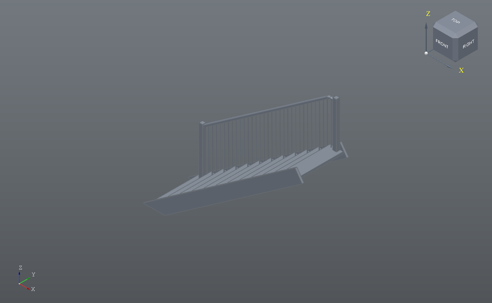

# Stair Railing

A part that is almost all code: two code features and two rules.

Open `Stair Railing.pdat`, press **Allow** in the dLogic panel, then the
**Size** button. Every tread, stringer, baluster and the handrail are
worked out again from the sliders.

| parameter | what it is |
|---|---|
| steps | how many treads |
| rise | height of one step |
| going | depth of one step, nosing to nosing |
| width | clear width |
| tread | tread thickness |
| rail_height | handrail height above the nosing line |
| baluster_gap | most space allowed between balusters |
| sides | 1 for a railing on one side, 2 for both |

**Stair** builds the treads and stringers. **Railing** builds the newel
posts, the balusters and a handrail swept up the pitch that turns level
into the top post. **Size** is the form. **Keep it comfortable** watches
rise, going and steps and writes the description.

`python examples/build_railing.py` rebuilds the file. See
[docs/DLOGIC.md](../../docs/DLOGIC.md) for everything a script can use.
